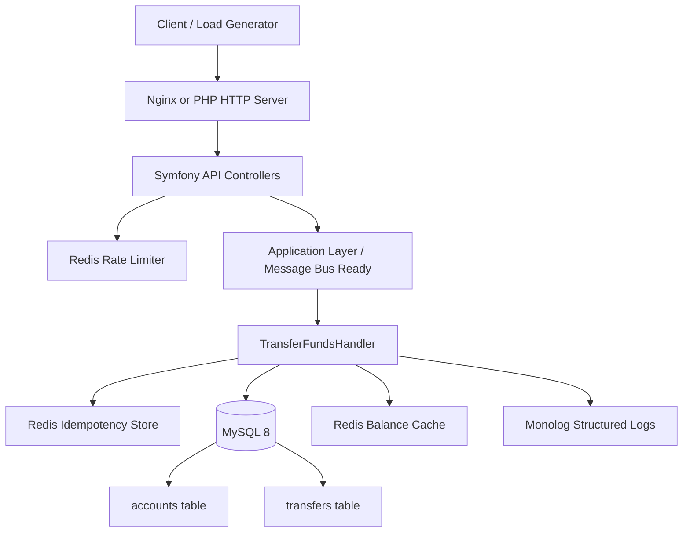

# Fund Transfer API

Production-oriented Symfony 7 API for transferring funds between accounts. Built with **PHP 8.3**, **MySQL 8**, and **Redis 7** for persistence, caching, idempotency, and rate limiting.

**Time spent:** ~6 hours (architecture, TDD, Docker, load tests, documentation)

## Requirement coverage checklist

| Requirement | Status | Evidence |
|-------------|--------|----------|
| Latest PHP + Symfony | ✅ | PHP 8.3+ and Symfony 7.4 in `composer.json` |
| MySQL + Redis for persistence/caching | ✅ | MySQL entities/repositories + Redis idempotency/cache/rate-limit |
| Fund transfers between accounts | ✅ | `POST /api/v1/transfers` and `POST /api/v2/transfers` |
| Reliability under load | ✅ | Redis rate limiting, idempotency replay, k6 load test script |
| Transaction integrity | ✅ | Single DB transaction + `FOR UPDATE` row locks + deterministic lock order |
| Modern PHP/Symfony practices | ✅ | Layered architecture (Domain/Application/Infrastructure/API), strict typing, DTO validation |
| Comprehensive tests incl. integration | ✅ | Unit + integration suites in `tests/Unit` and `tests/Integration` |
| Proper error handling and logging | ✅ | API exception listener + structured transfer logging |
| Clear setup and usage docs | ✅ | This README + `docs/API.md` + `docs/ARCHITECTURE.md` |
| Security considerations | ✅ | API key auth, validation, rate limiting, idempotency, no stack traces |

## Features

| Area | Implementation |
|------|----------------|
| Transfers | Atomic debit/credit with `SELECT … FOR UPDATE` (deadlock-safe ordering) |
| Integrity | DB transactions, optimistic locking (`version` column), minor-unit money |
| High load | Redis idempotency cache, balance read cache, transfer limiter (120 tx/min per key) |
| Security | API key auth (`X-Api-Key`), input validation, structured logging |
| Reliability | Mandatory `Idempotency-Key` header (24h Redis + DB unique constraint) |

## High-level architecture



### Request flow (transfer)

1. Client calls `POST /api/v1/transfers` (or v2) with API key and mandatory `Idempotency-Key`.
2. Controller validates payload, normalizes currency, and invokes application handler.
3. Handler checks idempotency (Redis fast-path, DB unique key as durable guard).
4. Handler opens one DB transaction, locks both accounts with `SELECT ... FOR UPDATE` in sorted order.
5. Balance is validated under lock, then debit/credit are applied atomically.
6. Transfer is persisted, account balance cache is invalidated, idempotency replay key is stored.
7. Structured logs are emitted; API returns `201` for new transfer or `200` for replay.

### Core components and responsibilities

- **API layer (`src/Api`)**: versioned controllers, request DTO validation, HTTP contract.
- **Application layer (`src/Application`)**: transfer use-case orchestration and business workflow.
- **Domain layer (`src/Domain`)**: money/account/transfer invariants and core rules.
- **Infrastructure layer (`src/Infrastructure`)**: Doctrine repositories, Redis adapters, auth, console commands.
- **Data stores**: MySQL for source-of-truth state, Redis for rate limiting, idempotency acceleration, and cache.

### Reliability and scaling design

- Row-level pessimistic locking + deterministic lock order for concurrency safety.
- Transactional debit/credit to guarantee no partial money movement.
- Redis + DB idempotency strategy for safe retries.
- Rate limiting to protect the API under burst load.
- Message-bus-ready structure so async queue processing (for very high throughput) can be introduced with minimal API contract changes.

### Centralized logging readiness

- Structured transfer logs are emitted with contextual fields (`from`, `to`, `amount`, `currency`, `idempotency_key`).
- Successful transfers are logged at `INFO`; failed attempts are logged at `ERROR`.
- In production mode, Monolog outputs JSON logs to `stdout`/`stderr`, which can be shipped to ELK/Datadog by a container log agent.
- See `docs/ARCHITECTURE.md` for the full central logging flow and deployment architecture.

### Input validation and API hardening

- Request body validation uses Symfony Validator DTO constraints (similar purpose to Zod schemas in Node.js).
- Transfer-create requests apply centralized header/content-type validation (`RequestValidationListener`) for:
  - required `Idempotency-Key`
  - strict `X-Api-Key`/`Idempotency-Key` header format
  - `Content-Type: application/json`
- API responses are JSON-only and no untrusted input is rendered as HTML, reducing XSS risk at the API layer.

## Quick start (Docker)

```bash
Naviagate to the root folder of this repo
cp .env.dist .env
docker compose -f docker-compose.yml up -d --build
docker compose -f docker-compose.yml exec php composer install
docker compose -f docker-compose.yml exec php php bin/console doctrine:migrations:migrate --no-interaction
docker compose -f docker-compose.yml exec php php bin/console app:seed-demo-accounts
curl http://localhost:8080/health
```

## Full run guide (all steps)

### Option A: Docker (recommended)

#### 1) Prerequisites

- Docker Desktop (with Compose v2)
- `make` (or run compose commands directly)

#### 2) Configure environment

```bash
cp .env.dist .env
```

#### 3) Start application stack

```bash
cd "c:\Users\ASUS\Desktop\Assignment\Paysera-assignmet" # move into project root
docker compose -f docker-compose.yml up -d --build # build images and start containers
docker compose -f docker-compose.yml exec php composer install # install PHP dependencies in php container
docker compose -f docker-compose.yml exec php php bin/console doctrine:migrations:migrate --no-interaction # apply DB schema migrations
docker compose -f docker-compose.yml exec php php bin/console app:seed-demo-accounts # insert demo accounts for testing
```

Equivalent `make` shortcut:
- `make setup` (up + install + migrate + seed)

#### 4) Verify health

```bash
curl http://localhost:8080/health
```

Expected: HTTP `200` and DB/Redis status in response.

#### 5) Run tests

```bash
docker compose -f docker-compose.yml exec php composer test
docker compose -f docker-compose.yml exec php composer test-unit
docker compose -f docker-compose.yml exec php composer test-integration
```

Equivalent `make` shortcut:
- `make test`
- `make test-unit`
- `make test-integration`

#### 6) Run load test

```bash
make load-test
```

#### 7) Stop services

```bash
docker compose -f docker-compose.yml down
```

### Create a transfer

```bash
curl -s -X POST http://localhost:8080/api/v1/transfers \
  -H "Content-Type: application/json" \
  -H "X-Api-Key: dev-api-key-001" \
  -H "Idempotency-Key: demo-transfer-001" \
  -d '{
    "fromAccountId": "11111111-1111-4111-8111-111111111111",
    "toAccountId": "22222222-2222-4222-8222-222222222222",
    "amount": "100.00",
    "currency": "EUR"
  }' | jq
```

### Demo accounts (after `make seed`)

| Name | UUID | Balance |
|------|------|---------|
| Alice | `11111111-1111-4111-8111-111111111111` | €100,000.00 |
| Bob | `22222222-2222-4222-8222-222222222222` | €50,000.00 |
| Charlie | `33333333-3333-4333-8333-333333333333` | €10,000.00 |

## API

| Method | Path | Description |
|--------|------|-------------|
| `GET` | `/health` | Liveness (DB + Redis) |
| `POST` | `/api/v1/transfers` | Transfer funds |
| `GET` | `/api/v1/transfers` | List transfers (paginated, filterable) |
| `GET` | `/api/v1/transfers/recent` | Last 30 days of transfers (configurable) |
| `GET` | `/api/v1/transfers/{reference}` | Transfer status |
| `GET` | `/api/v1/accounts/{id}` | Account details (balance cache) |
| `GET` | `/api/v1/accounts/{id}/transfers` | Transfers for an account |
| `POST` | `/api/v2/transfers` | Transfer funds (v2 envelope + optional description) |
| `GET` | `/api/v2/transfers` | List transfers (v2 envelope) |
| `GET` | `/api/v2/transfers/recent` | Recent transfers (v2 envelope) |
| `GET` | `/api/v2/transfers/{reference}` | Transfer details (v2 envelope) |

**Headers:** `X-Api-Key` (required on `/api`), `Idempotency-Key` (required on POST `/api/*/transfers`).

See [docs/API.md](docs/API.md) and [docs/ARCHITECTURE.md](docs/ARCHITECTURE.md).

## Tests (TDD)

Tests were written alongside domain and application code.

```bash
make test              # all tests
make test-unit         # Money, Account, TransferFundsHandler
make test-integration  # HTTP API + DB + Redis
```

## Load testing (k6)

```bash
make load-test
```

Sample output: [load-tests/results/sample-output.txt](load-tests/results/sample-output.txt) (~50 req/s, p95 &lt; 500ms).

## Local development (without Docker)

Requirements: PHP 8.3+, Composer, MySQL 8, Redis 7.

```bash
composer install
cp .env.dist .env.local   # adjust DATABASE_URL, REDIS_URL, API_KEYS
php bin/console doctrine:migrations:migrate
php bin/console app:seed-demo-accounts
symfony server:start -d --port=8080   # or: php -S localhost:8080 -t public
composer test
```

## AI tools used

| Tool | Usage |
|------|--------|
| **Cursor (Claude)** | Project scaffolding, architecture review, test cases, documentation |
| **Prompts (examples)** | “Design Symfony fund transfer with pessimistic locking and idempotency”; “Write PHPUnit integration tests for idempotent transfers”; “k6 script for 50 RPS transfer load test” |

All code was reviewed for correctness, security, and alignment with assignment requirements.

## Repository structure

```
src/Domain/          # Money, Account, Transfer (framework-free)
src/Application/     # TransferFundsHandler, ListTransfersHandler (use cases)
src/Infrastructure/  # Doctrine, Redis, Security
src/Api/             # Versioned controllers (V1/, V2/), DTOs, listeners
tests/Unit|Integration/
load-tests/          # k6 scripts + sample output
migrations/
docker/
```

> **Note:** Symfony’s default `src/Entity`, `src/Controller`, and `src/Repository` folders are intentionally unused. Doctrine entities live under `src/Infrastructure/Persistence/Doctrine/Entity/` and HTTP controllers under `src/Api/Controller/V1/` and `V2/`. Add future resources (users, products, orders) using the same pattern: Domain → Application → Infrastructure → `Api/Controller/V{n}/`.

## Extendible production versions (next-step roadmap)

The current implementation is intentionally designed to evolve safely.  
Below are key production extensions, why they matter, and implementation steps.

### 1) Durable idempotency (DB-backed)

**Goal:** keep idempotency guarantees even if Redis is unavailable or keys are evicted.

- Keep Redis as fast-path cache for repeated responses (24h TTL).
- Persist idempotency in MySQL with a unique constraint (`idempotency_key`).
- On duplicate key, return the existing transfer result instead of re-executing.
- Store status (`in_progress`, `completed`, `failed`) and final response payload.

**Implementation steps**

1. Add an `idempotency_records` table (or extend transfer table) with `UNIQUE(idempotency_key)`.
2. Insert record at transfer start (inside transaction boundary where applicable).
3. On duplicate insert conflict, fetch existing result and return it.
4. Keep Redis cache as optional accelerator, not source of truth.

### 2) Double-spend prevention at debit time

**Goal:** validate available balance under lock, immediately before debit.

- Lock both account rows with `SELECT ... FOR UPDATE`.
- Re-check `from` account balance inside the same transaction after lock acquisition.
- Reject with domain error if balance is insufficient at that exact moment.
- Apply debit/credit only after this locked-state validation.

**Implementation steps**

1. Acquire locks in deterministic order (already used).
2. Move/ensure `InsufficientFunds` check happens after lock acquisition.
3. Keep debit + credit + transfer row in one transaction.
4. Add integration tests with concurrent requests to verify no overdraft is possible.

### 3) Immutable ledger integrity

**Goal:** preserve a complete, tamper-evident financial audit trail.

- Write immutable ledger entries for each movement leg (debit and credit).
- Include `before_balance`, `after_balance`, `currency`, `transfer_reference`.
- Add `correlation_id` and `idempotency_key` for tracing.
- Never update/delete ledger rows; only append.

**Implementation steps**

1. Create `ledger_entries` table (append-only policy).
2. Persist two rows per transfer (debit leg + credit leg) in same DB transaction.
3. Enforce immutability at app/service layer (and optionally DB permissions/triggers).
4. Add reconciliation jobs and reports based on ledger sums.

### 4) Retry policy (transient-only)

**Goal:** retry only errors that can succeed on a later attempt.

- Retry transient DB exceptions only (deadlock, lock wait timeout, connection blips).
- Never retry domain/business errors (`InsufficientFunds`, currency mismatch, not found).
- Use exponential backoff (e.g., 50ms, 100ms, 200ms) with max attempt cap.
- Emit structured logs/metrics for retry counts and exhausted retries.

**Implementation steps**

1. Classify exceptions into retryable vs non-retryable.
2. Apply retry middleware/wrapper around transfer handler.
3. Keep idempotency key mandatory/recommended on client retries.
4. Alert on retry exhaustion rate crossing threshold.

## Expected follow-up questions from interviewer

### Category 1: Concurrency & database design

**Q1: Why pessimistic locking instead of optimistic? Trade-offs?**  
**Expected answer:** Pessimistic locking serializes concurrent transfers on the same account immediately, reducing application-level retry storms. Trade-off is lower throughput under high contention because locks are held during transaction time. Optimistic locking is better for read-heavy, low-contention workloads, but in payments correctness is prioritized over throughput. The `version` column keeps flexibility for future strategy changes.

**Q2: How would this handle 10,000 concurrent transfers from one account?**  
**Expected answer:** Requests serialize at row-lock level for that account. The DB connection pool queues up to its configured size; excess pressure may cause connection saturation errors. Mitigations include queue-based async processing (Messenger), API rate limiting, and scaling read workloads via replicas.

**Q3: What if MySQL deadlocks? How does retry work?**  
**Expected answer:** Deadlocks are transient and expected in high contention. The handler retries retryable DB errors up to 3 times with exponential backoff (50ms, 100ms, 200ms). If still failing, it returns a server error and relies on client retry with the same idempotency key.

**Q4: What about partial failure (debit succeeds, credit fails)?**  
**Expected answer:** Debit and credit are in one DB transaction. Any exception triggers rollback, so neither side is committed alone. ACID atomicity prevents partial money movement.

### Category 2: Idempotency & distributed systems

**Q5: If Redis is down, does transfer still work?**  
**Expected answer:** Yes, transfer still executes. Redis acts as acceleration; DB-backed idempotency is the durable source. If only Redis were used, duplicate risk would rise during outages, which is why DB unique key is preferred.

**Q6: What race exists in idempotency check?**  
**Expected answer:** Non-atomic flow (`check -> execute -> set`) allows a duplicate window. Mitigate with atomic Redis `SETNX`/lock and, more importantly, DB unique constraint on `idempotency_key` as final guard.

**Q7: Idempotency across multiple services?**  
**Expected answer:** Propagate a single idempotency key end-to-end and enforce uniqueness at the write boundary (transaction/ledger service). For longer workflows, use saga orchestration and compensating actions.

### Category 3: Performance & scaling

**Q8: How to scale to 1M transfers/minute?**  
**Expected answer:** Move from single-writer bottleneck to partitioned architecture: account sharding, queue-based async workers, CQRS (read/write split), and event-driven pipelines. Add connection pool tuning and horizontal worker scaling.

**Q9: Why integer amounts? What about Bitcoin 8 decimals?**  
**Expected answer:** Integers avoid floating-point rounding errors. For higher precision assets, use fixed-point (`NUMERIC`) or `BIGINT + scale` representation per currency/asset.

**Q10: How to add multi-currency support?**  
**Expected answer:** Introduce exchange-rate source/table and a `CurrencyExchangeService`. Lock accounts, snapshot applicable rate, apply conversion deterministically, and persist the used rate in transaction records.

### Category 4: Testing & reliability

**Q11: How to test concurrent transfer scenarios?**  
**Expected answer:** Add integration tests that fire concurrent requests/processes against the same accounts. Assert money conservation, no negative balances, and retry logic effectiveness under contention.

**Q12: What monitoring/alerting is needed?**  
**Expected answer:** Capture latency (p50/p95/p99), success/failure rates, retry counts, idempotency hit ratio, and pool utilization. Alert on spikes in 4xx/5xx classes, retry exhaustion, and Redis/DB connectivity issues.

### Category 5: API design & security

**Q13: Why POST, not PUT/PATCH, for transfers?**  
**Expected answer:** Each transfer creates a new transaction resource, which aligns with `POST`. Idempotency is handled at application level using `Idempotency-Key`.

**Q14: How to add authn/authz?**  
**Expected answer:** Add JWT/API-key identity, bind accounts to principals, enforce ownership/permissions at middleware/listener level, and apply per-user/service rate limits.

**Q15: What validation is still missing?**  
**Expected answer:** Add same-account transfer prohibition, max transfer limits (compliance), account status checks (frozen/closed), and optional fraud/risk screening hooks.

### Category 6: Architecture evolution

**Q16: How to evolve to event sourcing?**  
**Expected answer:** Persist domain events (`FundsDebited`, `FundsCredited`, etc.) as source of truth and build balance projections from event streams. Benefits are full auditability and replay; challenges are eventual consistency and snapshot/version management.

**Q17: ACID across multiple microservices?**  
**Expected answer:** Use Saga orchestration with compensating actions for distributed consistency, plus Outbox pattern to atomically persist state change + publish intent with at-least-once delivery guarantees.

## Key points to emphasize in discussion

- Correctness over throughput for financial safety.
- Trade-offs are explicit and intentional.
- Observability and operability are first-class concerns.
- Current architecture keeps a clear path to async/event-driven evolution.
- Security/compliance extensions are acknowledged and prioritized.

## License

MIT
